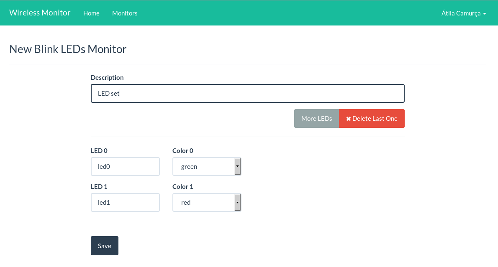
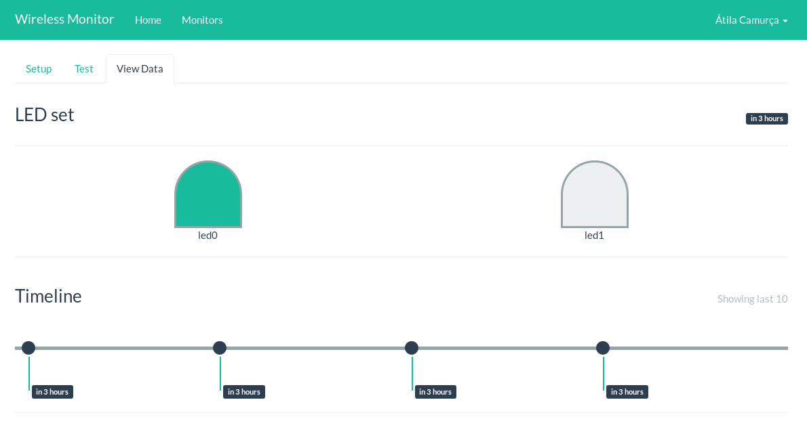

# Pisca LEDs

Nesse plugin o desenvolvedor cria um conjunto de leds, identificados por um ID
e uma cor.

A visualização mostra a última configuração informada de como o LED se encontra
(aceso ou apagado), bem como uma _Timeline_ para verificar estados anteriores.

