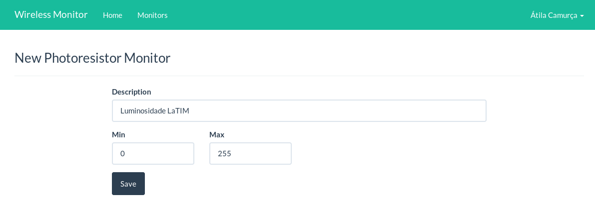
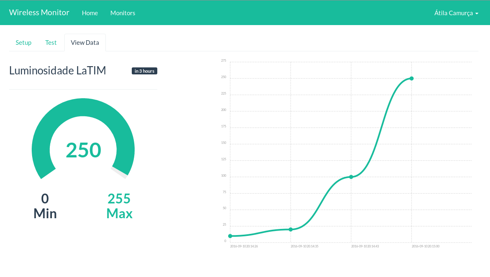

# Luminosidade

Nesse plugin é necessário apenas a luminosidade mínima e máxima, normalmente
`0` e `255`.

A visualização mostra a última configuração informada, bem como um
gráfico para verificar estados anteriores.

