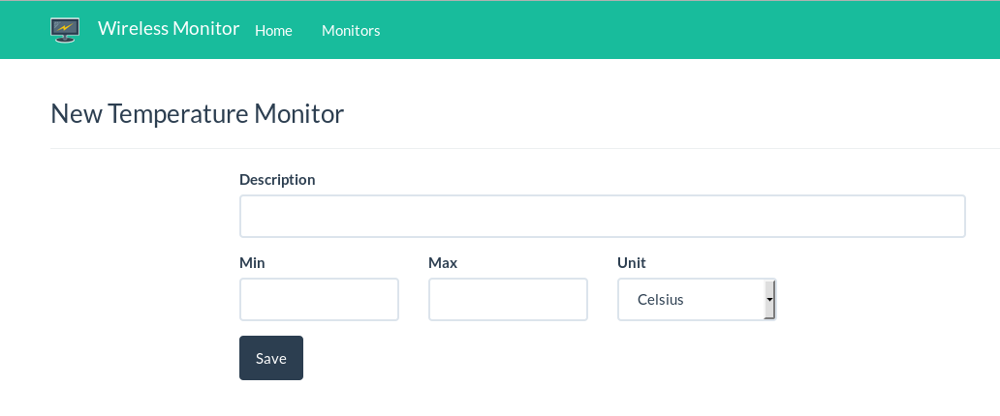

# Temperatura

Nesse plugin é necessário apenas a temperatura mínima e máxima, e a unidade.

A visualização mostra a última configuração informada, bem como um
gráfico para verificar estados anteriores.

